# The history of the world cup

## Introduction
In preparation for the 2022 FIFA men's world cup, I decided put my new found SQL skills to the test by querying a kaggle dataset on [all international football games from 1872 to date](https://www.kaggle.com/datasets/martj42/international-football-results-from-1872-to-2017) to help tell a story about the history of the FIFA World Cup.

In this repository, you will be reading about some of the interesting facts I found out while querying the dataset about the FIFA World Cup tournament . Hope you enjoy it 😄.

The SQL codes can be found [here](https://github.com/elvin-7/History-of-the-world-cup-with-MSSQL/blob/main/World%20Cup%20Project.sql)

## Story-time : A little history about the FIFA World Cup (with MSSQL)
It’s here again! The biggest sporting event in history is about to kick off and once again 32 nations (sorry Nigeria) are headed to Qatar to fight for football’s most prestigious award, the FIFA world cup. The usual buzz within the general public around the world cup frankly has been unnoticeable to me this year. Perhaps it has to do with it interrupting the European football season or maybe the controversy around Qatar being the hosts. Regardless, I’m pretty excited for what’s to come and I am hoping that after you read this, you would be a bit more prepared going into the 2022 FIFA world cup.

### Data
---

Original dataset|Filtered dataset
----------------|-----------------
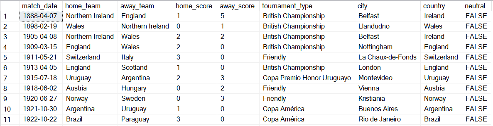|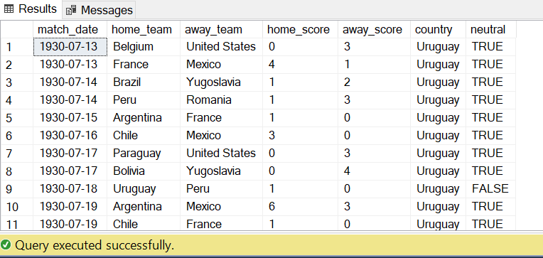

  From the images above, you can see how the difference between the original dataset and the dataset I ended up working with. I first filtered the original dataset to show only World Cup games.
From the filtered data, we can see that the first ever world cup games were played between Belgium and United States and France and Mexico in 1930 with the United States and France emerging as 3–0 and 4–1 winners respectively. The query returned exactly 900 rows which means the 2018 world cup final between France and Croatia was the 900th ever FIFA world cup game.

### Tournament hosts
---

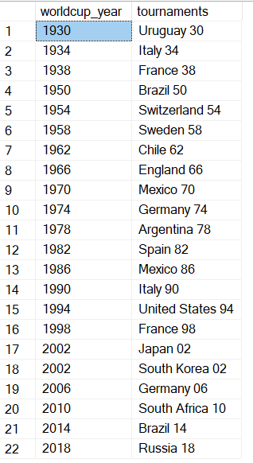

Here, we have a list of every world cup host. You would also notice that in 2002, Japan and Korea were cohosts for the World Cup.

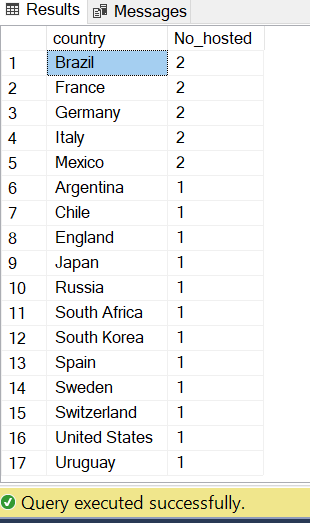

We also see that there have been 17 different nations which have had the honor of hosting a world cup with Brazil, France, Germany, Italy and Mexico hosting the tournament two times each.

### Win percentages
---

We have already found out that there have been exactly 900 games played at the world cup now, let’s see how these games have been distributed among the different nations.

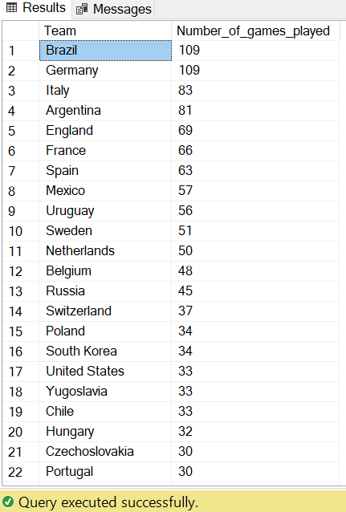

In total, 81 different nations have competed in the world cup. Brazil and Germany tied for the most games at 109. At the other end of the table, we have Indonesia with a sole game to their name.

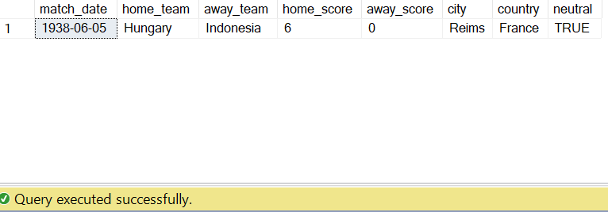

Indonesia’s only game at the world cup was in 1938 in a 6–0 loss to Hungary in France. At the time, a straight knockout format was used as opposed to the group and knockout format we have today and unfortunately Indonesia have not qualified for the world cup since.

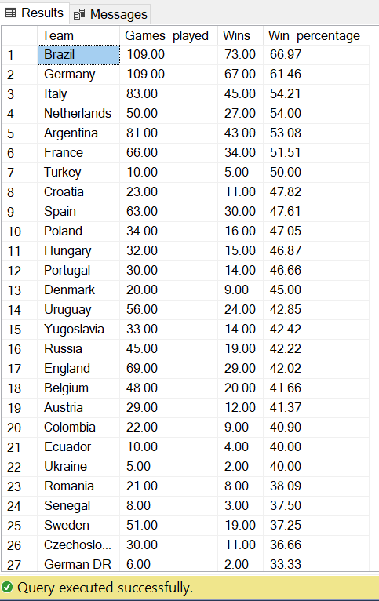

Brazil maintain top spot as the team with the highest winning rate at the world cup at 66.97%. What really stood out to me from this query was England’s 42.02% winning rate at the World cup. This means that they have the worst winning rate of any nation that has ever won a world cup.

### World Cup Finals
---

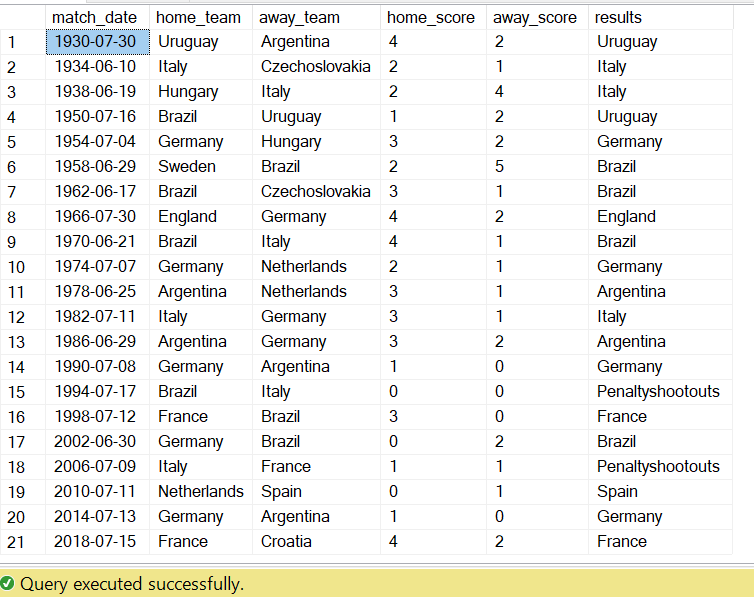

  The table above shows the result of every world cup final. From this, we can see that there have been 2 finals out of the 21 which were decided via penalties, the 1994 final between Brazil and Italy and the infamous Zidane 2006 final between France and Italy.

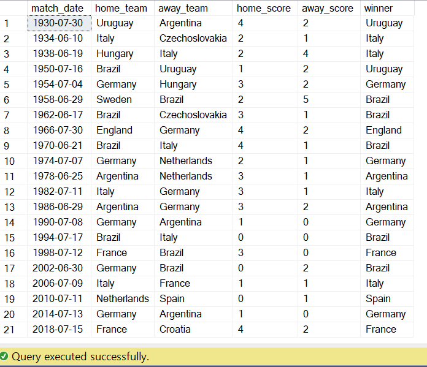

After checking with the penalty shootout data, the only 2 finals which had to be decided by a penalty shootouts were won by Brazil against Italy in 1994 and Italy against France in 2006. Also, the 1994 final was the only one without any goals in 120 minutes of football.

### Goals
---

Nothing beats the adrenaline of watching your team hit the back to the net. The objective of the beautiful game is to essentially score more goals than the opposition and in recent years, we have been treated to a wonderful collection of some truly phenomenal goals; I’m talking Van Persie’s flying Dutchman vs Spain in 2014, James Rodriguez’s control and half volley finish in the same year, Zidane’s cheeky penalty in the 2006 final and more recently Benjamin Pavard’s lovely volley against Leo Messi’s Argentina. We have seen and admired the goals, it is time to do the same for the numbers.

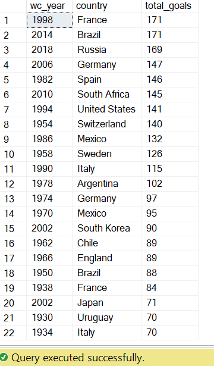

France ’98 and Brazil 2014 lead the way for goals in a tournament with 171 each. The 2002 world cup had 161 goals in total which would see it as the 4th highest scoring tournament but it is fun to see that 90 of those goals were scored in South Korea with the other 71 coming in Japan.

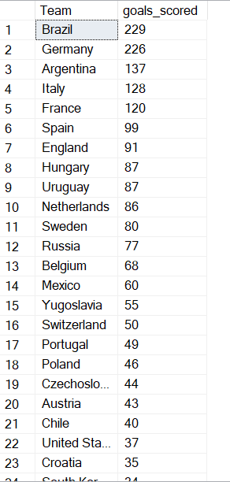

Again, Brazil are on top of the pile boasting an incredible 229 goals in 109 games played at the world cup. Germany are 3 goals behind at 226 and even more exciting is the fact that whoever scores the first goal for Spain, if they do score a goal (they will), at the 2022 world cup would be scoring the country’s 100th ever goal at the world cup. Also, Canada would be the only non-debutants going into the 2022 world cup in Qatar looking for their first ever world cup goal.

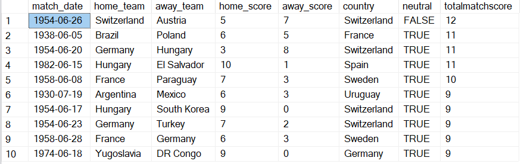

Here, we have the top 10 highest scoring games ever in world cup history. The most goals scored in a single game coming when Switzerland lost 5–7 to Austria at home in front of their own fans. The 1954 tournament in Switzerland must have been a treat for the fans with 4 games in the competition making the top 10 for the highest scoring games in the world cup.

### Penalty Shootouts
---

>Football is a simple game, 22 men chase the ball for 90 minutes and at the end, the Germans win — Gary Lineker.

In the 1990 world cup semi final, England lost to Germany on penalties and in his disappointment, the legendary English Striker gave birth to the quote above. We’ve seen how good the German’s are so far in a lot of categories. It’s time to look at how they (and everyone else) fare in a penalty shootout.

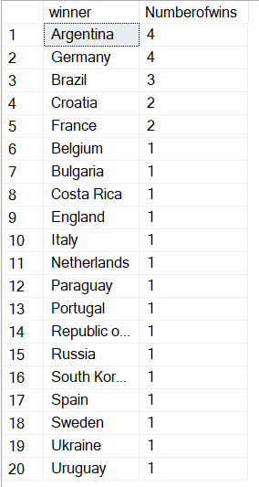

Turns out they are pretty good at penalties too, leading the way together with Argentina with 4 wins in the competition. I couldn’t help noticing that Uruguay have just one win to their name and if you are Ghanaian, like I am, it would be hard to forget which one that was.

I hope you have enjoyed reading the article and hopefully it has you a bit more hyped before the world cup starts. And if you hear any commentators mention how Canada have made history with their first world cup goal in Qatar 2022 remember, you read it here first 😉.
